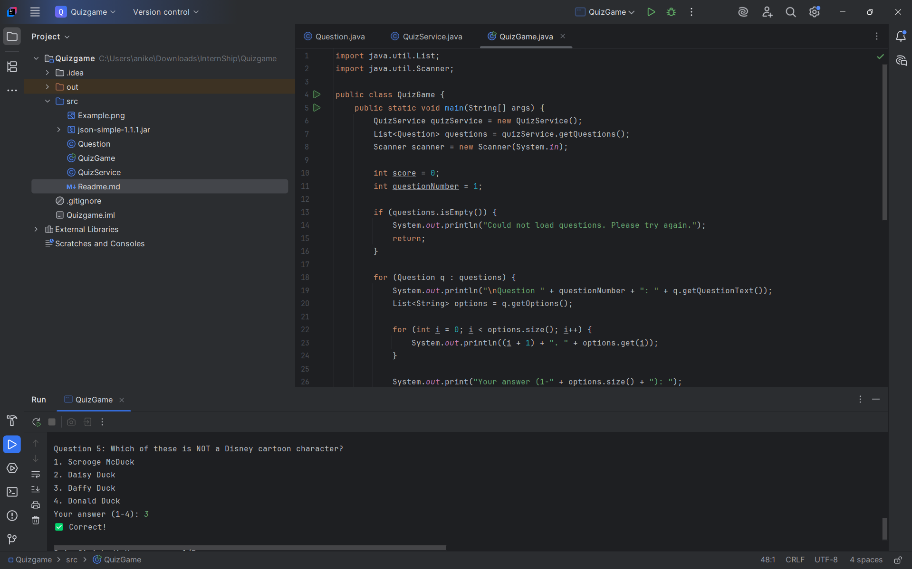

# Java Quiz Game (Console-Based)

Quiz Game
This is a simple Multiple choice Quiz Game written in java which fetches general knowledge questions from an open API and the let user play quiz in the console.

📋 Technologies Used
Java Development Kit (JDK) 8 or higher
Open Trivia DB API
Visual Studio Code
▶️ How to Run
Open a terminal or command prompt.
Navigate to the folder containing QuizGame.java.
Compile the program:
javac QuizGame.java
Run the program:
java QuizGame
🌐 API Used
Open Trivia DB
Example: https://opentdb.com/api.php?amount=5
✨ Features
Uses HTTPURLConnection to fetch questions from an online trivia API.
Displays 4 options for each question.
Shows result in the form of Correct and Incorrect.

---

## Features
- Gets live quiz questions from API
- Randomizes multiple-choice options
- Accepts user input and checks answers
- Tracks score and shows final result

---

## Technologies Used
- Java (JDK 8+)
- JSON.simple (v1.1.1)
- Open Trivia DB API
- IntelliJ Idea

---

## Files Included
- `QuizGame.java` – main game logic
- `QuizService.java` – handles API and parsing
- `Question.java` – model for each question
- `json-simple-1.1.1.jar` – library for JSON

---

## How to Run

On IntelliJ

Open project → Add .java files to src

Add json-simple-1.1.1.jar to 

Project Structure → Libraries

Run QuizGame.java

## API Used
Open Trivia DB

Example: https://opentdb.com/api.php?amount=5&type=multiple

## Screenshot Example 
Below is a screenshot showing the quiz running in IntelliJ IDEA:

Submitted by SHANTANU SHRIVASTAV.
